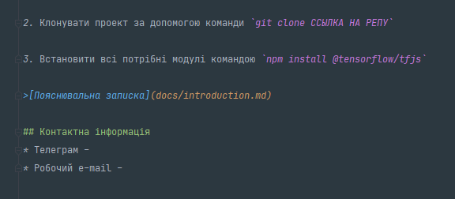

# Tensorflow.js

## Налаштування проекту
Для початку потрібно:

1. Клонувати проект за допомогою команди `git clone ССЫЛКА НА РЕПУ`

2. Встановити всі потрібні модулі командою `npm install @tensorflow/tfjs`

>[Пояснювальна записка](docs/introduction.md)

## Контактна інформація
* Телеграм - 
* Робочий e-mail - 

## Інше
[Методичні вказівки](https://jace-dev.herokuapp.com/design/js-talks#/)

[Звітність](https://drive.google.com/file/d/1A5Pxqb0Esy78t9xhMlkWzzx4chdkXAl2/view?usp=sharing)