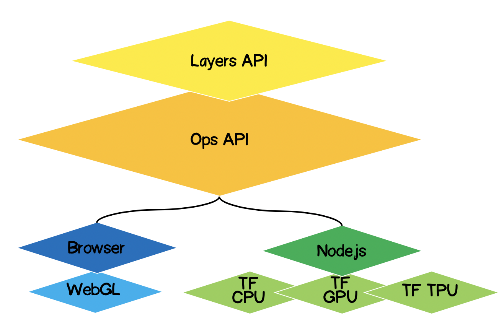
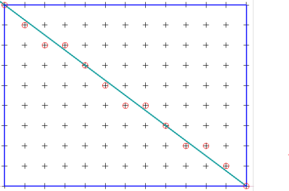
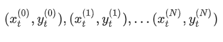

# TensorFlow.js

## Вступ

Зараз Python займає домінуючу позицію для машинного навчання. Однак, якщо ви є JS-розробником і зацікавлені зануритися в цей світ, то не обов'язково включати
у свій арсенал нову мову програмування, у зв'язку з появою TensorFlow.js.

Переваги використання TensorFlow.js в браузері

+ Інтерактивність — браузер має багато інструментів для візуалізації процесів, що відбуваються (графіки, анімація та ін.);


+ Сенсори - браузер має прямий доступ до сенсорів пристрою (камера, GPS, акселерометр і ін.);


+ Захищеність даних користувача - нема потреби відправляти оброблювані дані на сервер;
сумісність з моделями, створеними на Python.


+ Продуктивність - Одним з головних питань постає питання продуктивності.
У зв'язку з тим, що машинне навчання - це, по суті, виконання різного роду математичних операцій
з матрично-подібними даними (тензорами), то бібліотека для такого роду обчислень в браузері використовує WebGL.
Це значно збільшує продуктивність, якби ті ж операції здійснювалися на чистому JS.


    "Для підвищення продуктивності на Node.js використовується native-binding з TensorFlow.
     Тут в якості акселераторів можуть служити CPU, GPU і TPU ( Tensor Processing Unit )"

## Архітектура TensorFlow.js
+ Lowest Layer - цей шар відповідальний за паралелізацію обчислень при здійсненні математичних операцій над тензорами.


+ The Ops API - надає АПІ для здійснення математичних операцій над тензорами.


+ Layers API - дозволяє створювати складні моделі нейронних мереж з використанням різних видів шарів (dense, convolutional).
***Цей шар схожий на API Keras на Python і має можливість завантажувати попередньо навчені мережі на базі Keras Python.***


## Постановка задачі

    "Як приклад використання фреймворку ставимо задачу апроксимації"

Необхідно знайти рівняння апроксимуючої лінійної функції по заданому набору експериментальних точок.
Іншими словами, нам треба знайти таку лінійну криву, яка лежала б найближче до експериментальних точок.



### Формалізація рішення
Ядром будь-якого машинного навчання буде модель, в нашому випадку це рівняння лінійної функції

#<center>y = kx+b</center>

Виходячи з умови, ми також маємо набір експериментальних точок

#<center></center>

Припустимо, що на i-ом кроці навчання були обчислені коефіцієнти лінійного рівняння.
Зараз нам необхідно математично виразити на скільки точні підібрані коефіцієнти.
Для цього нам необхідно порахувати помилку (loss), яку можна визначити, наприклад, по середньоквадратичного відхилення.


    "Tensorflow.js пропонує набір найбільш часто використовуваних loss функцій:
    tf.metrics.meanAbsoluteError,
    tf.metrics.meanSquaredError
    і ін."

### Рішення за допомогою TensorFlow.js

Гарна новина в тому, що нам не доведеться займатися написанням оптимізаторів для заданої функції помилки (loss),
ми не будемо розробляти чисельні методи обчислення частинних похідних, за нас вже реалізували алгоритм зворотного
поширення помилки (backpropogation).
Нам лише потрібно виконати наступні кроки:

+ задати модель (лінійну функцію, в нашому випадку);
+ описати функцію помилки (в нашому випадку, це середньоквадратичне відхилення)
+ вибрати один з реалізованих оптимізаторів (є можливість розширити бібліотеку власної реалізації)

>Надалі буде часто використовуватися поняття тензору. Детальніше про деякі з них [тут](../src/models.md)

### Лінійна апроксимація за допомогою TensorFlow.js
Спочатку обговоримо, що ми будемо робити код розширюваним.
Лінійну апроксимацію зможемо переробити в апроксимацію експериментальних точок по функції будь-якого виду.


Почнемо реалізовувати методи абстрактного класу, за винятком абстрактних методів, які будуть визначені в дочірніх класах,
а тут залишимо лише заглушки з помилками, якщо з якоїсь причини метод не буде визначено в дочірньому класі.


```js

    import * as tf from '@tensorflow/tfjs';
    export default class AbstractRegressionModel {
        constructor(
            width,
            height,
            optimizerFunction = tf.train.sgd,
            maxEpochPerTrainSession = 100,
            learningRate = 0.1,
            expectedLoss = 0.001
        ) {
            this.width = width;
            this.height = height;
            this.optimizerFunction = optimizerFunction;
            this.expectedLoss = expectedLoss;
            this.learningRate = learningRate;
            this.maxEpochPerTrainSession = maxEpochPerTrainSession;

            this.initModelVariables();

            this.trainSession = 0;
            this.epochNumber = 0;
            this.history = [];
        }
    }
```

Отже, в конструкторі моделі ми визначили width і height - це реальна ширина і висота площини, на якому ми будемо 
розставляти експериментальні точки. Це необхідно для нормалізації вхідних даних


optimizerFunction - зробимо завдання оптимізатора гнучким, для того щоб була можливість спробувати інші наявні в бібліотеці оптимізатори,
за замовчуванням ми задали метод стохастичного градієнтного спуску tf.train.sgd. Порекомендував би також погратися з іншими доступними оптимізаторами,
які під час навчання можуть підлаштовувати learningRate і процес навчання значно поліпшується, 
наприклад, спробуйте наступні оптимізатори: tf.train.momentum, tf.train.adam.


Для того щоб процес навчання не був нескінченним ми визначили два параметри maxEpochPerTrainSesion і expectedLoss- 
таким чином ми припинимо процес навчання або при досягненні максимального числа навчальних ітерацій, 
або коли значення функції-помилки стане нижчою за очікувану помилку.


У конструкторі ми викликаємо метод initModelVariables - але як і домовлялися, ми ставимо заглушку і визначимо його в дочірньому класі пізніше.

```js
initModelVariables() {
    throw Error('Model variables should be defined')
}
```
Зараз реалізуємо основний метод моделі train:

```js
/**
     * Train model until explicitly stop process via invocation of stop method
     * or loss achieve necessary accuracy, or train achieve max epoch value
     *
     * @param x - array of x coordinates
     * @param y - array of y coordinates
     * @param callback - optional, invoked after each training step
     */
    async train(x, y, callback) {
        const currentTrainSession = ++this.trainSession;
        this.lossVal = Number.POSITIVE_INFINITY;
        this.epochNumber = 0;
        this.history = [];

        // convert array into tensors
        const input = tf.tensor1d(this.xNormalization(x));
        const output = tf.tensor1d(this.yNormalization(y));

        while (
            currentTrainSession === this.trainSession
            && this.lossVal > this.expectedLoss
            && this.epochNumber <= this.maxEpochPerTrainSession
            ) {
            const optimizer = this.optimizerFunction(this.learningRate);
            optimizer.minimize(() => this.loss(this.f(input), output));
            this.history = [...this.history, {
                epoch: this.epochNumber,
                loss: this.lossVal
            }];
            callback && callback();
            this.epochNumber++;
            await tf.nextFrame();
        }
    }

```

trainSession - це по суті унікальний ідентифікатор сесії навчання на той випадок, якщо зовнішній АПИ викликатиме train метод,
при тому що попередня сесія навчання ще не завершилася.

З коду ви бачите, що ми з одновимірних масивів створюємо tensor1d, при цьому дані необхідно попередньо нормалізувати, функції для нормалізації тут:

```js
xNormalization = xs => xs.map(x => x / this.width);
yNormalization = ys => ys.map(y => y / this.height);
yDenormalization = ys => ys.map(y => y * this.height);
```

У циклі для кожного кроку навчання ми викликаємо оптимізатор моделі, якому необхідно передати loss функцію.
Як і домовлялися, loss-функція у нас буде задана середньоквадратичним відхиленням. Тоді користуючись АПИ tensorflow.js маємо:


```js
    /**
     * Calculate loss function as mean-square deviation
     *
     * @param predictedValue - tensor1d - predicted values of calculated model
     * @param realValue - tensor1d - real value of experimental points
     */
    loss = (predictedValue, realValue) => {
        // L = sum ((x_pred_i - x_real_i)^2) / N
        const loss = predictedValue.sub(realValue).square().mean();
        this.lossVal = loss.dataSync()[0];
        return loss;
    };
```

Процес навчання триває поки

+ не буде досягнутий ліміт за кількістю ітерацій
+ не буде досягнута бажана точність помилки
+ не почато новий навчальний процес

На кожному кроці навчання в властивості об'єкта моделі history ми зберігаємо динаміку зміни помилки на кожній епосі навчання.

Після процесу навчання моделі ми повинні мати метод, який брав би вхідні параметри і видавав обчислені вихідні параметри використовуючи навчену модель. 
Для цього в АПИ ми визначили predict метод і виглядає він так:

```js
/**
     * Predict value basing on trained model
     *  @param x - array of x coordinates
     *  @return Array({x: integer, y: integer}) - predicted values associated with input
     *
     * */
    predict(x) {
        const input = tf.tensor1d(this.xNormalization(x));
        const output = this.yDenormalization(this.f(input).arraySync());
        return output.map((y, i) => ({ x: x[i], y }));
    }
```

Зверніть увагу на arraySync, за аналогією як node.js, якщо є arraySync метод, то однозначно є й асинхронний метод array, 
який повертає Promise. Promise тут потрібен, тому що як ми говорили раніше, тензори все мігрують в WebGL для прискорення 
і процес стає асинхронним, тому що треба час для переміщення даних з WebGL в JS змінну.

>ДЕТАЛЬНІШЕ ПРО АСИНХРОННІСТЬ В JS [ВІД МОГО КОЛЕГИ З ПОТОКУ))](https://github.com/ForeverProglamer/async-code-in-js/blob/master/doc/asynchronous_programming.md)

Ми закінчили з абстрактним класом, повну версію коду ви можете подивитися [тут](../src/AbstractRegressionModel.js)

Для лінійної регресії визначимо новий клас, який буде успадкований від абстрактного класу, де нам треба визначити тільки два методи initModelVariables і f.

Так як ми працюємо над лінійною апроксимацією, то ми повинні поставити дві змінні k, b - і вони будуть тензорами-скалярами. 
Для оптимізатора ми повинні вказати, що вони є налаштованим (змінними), а в якості початкових значень дамо довільні числа.

```js
initModelVariables() {
   this.k = tf.scalar(Math.random()).variable();
   this.b = tf.scalar(Math.random()).variable();
}
```

```js
tf.variable (initialValue, trainable?, name?, dtype?)
``` 

Слід звернути увагу на другий аргумент trainable - булева змінна і за замовчуванням вона true. 
Вона використовується оптимізаторами, що говорить їм - чи потрібно при мінімізації loss-функції конфігурувати дану змінну. 

Це може бути корисним, коли ми будуємо нову модель на базі попередньо навченої моделі, завантаженої з Keras Python, і ми впевнені, 
що перенавчати деякі шари в цій моделі нема потреби.

Далі нам необхідно визначити рівняння апроксимуючої функції що використовує tensorflow API, погляньте на код і ви інтуїтивно зрозумієте як використовувати його:

```js
f(x) {
   // y = kx + b
   return  x.mul(this.k).add(this.b);
}
``` 

Наприклад, таким чином ви можете задати квадратичную апроксимацію:

```js
initModelVariables() {
   this.a = tf.scalar(Math.random()).variable();
   this.b = tf.scalar(Math.random()).variable();
   this.c = tf.scalar(Math.random()).variable();
}

f(x) {
    // y = ax^2 + bx + c
    return this.a.mul(x.square()).add(this.b.mul(x)).add(this.c);
}
``` 

+ ### Тести

>Всі тести знаходяться [тут](../tests/test_result.md)


