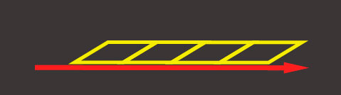
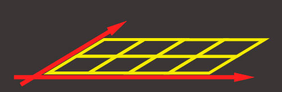
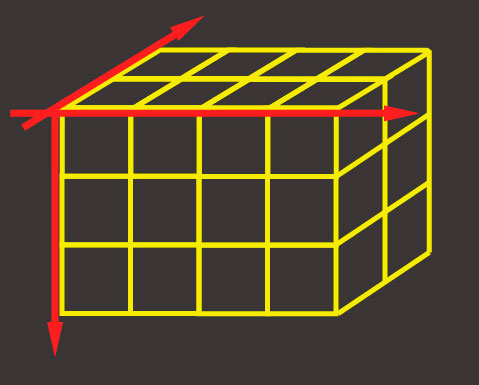

### Що таке тензор
Абсолютно кожен стикався з тензорами в математиці - це скаляр, вектор, 2D - матриця, 3D - матриця. 
Тензор - це узагальнене поняття всього перерахованого. Це контейнер даних, який містить однорідні за типом дані 
(tensorflow підтримує *int32*, *float32*, *bool*, *complex64*, *string*) і має певну форму (кількість осей). 
Нижче ми розглянемо тензори аж до 3D-матриць

TensorFlow має наступний АПИ для створення тензора:


```js
    tf.tensor (values, shape?, dtype?)
```

де shape - форма тензора і задається масивом, в якому кількість елементів - це кількість осей, 
а кожне значення масиву визначає кількість елементів вздовж кожної з осей. 
Наприклад, для завдання матриці розміром 4x2 (4 рядки, 2 колонки), форма набуде вигляду [4, 2].

# Скаляр


Ранк: 0

Форма: []

JS структура:
2

TensorFlow API:
```js
tf.scalar(2);
tf.tensor(2, []);
```


# Вектор


Ранк: 1

Форма: [4]

JS структура:
[1, 2, 3, 4]

TensorFlow API:
```js
tf.tensor([ 1, 2, 3, 4]);
tf.tensor([1, 2, 3, 4], [4]);
tf.tensor1d([1, 2, 3, 4]);
```


# Матриця


Ранк: 2

Форма: [4,2]

JS структура:
```
[
    [1, 2], 
    [3, 4], 
    [5, 6], 
    [7, 8]
]
```

TensorFlow API:
```js
tf.tensor([[1, 2],[3, 4],[5,6],[7,8]]);
tf.tensor([1, 2, 3, ... 7, 8], [4,2]);

tf.tensor2d([[1, 2],[3, 4]...[7,8]]);
tf.tensor2d([1, 2, 3, ... 7, 8], [4,2]);
```


# Матриця


Ранк: 3

Форма: [4,2,3]

JS структура:
```js
[
    [ [ 1,  2], [ 3,  4], [ 5,  6] ],
    [ [ 7,  8], [ 9, 10], [11, 12] ],
    [ [13, 14], [15, 16], [17, 18] ],
    [ [19, 20], [21, 22], [23, 24] ]
]
```

TensorFlow API:
```js
tf.tensor([ 
    [ [ 1,  2], [ 3,  4], [ 5,  6] ],
    ....
    [ [19, 20], [21, 22], [23, 24] ] 
]);
tf.tensor([1, 2, 3, .... 24], [4, 2 ,3])
```